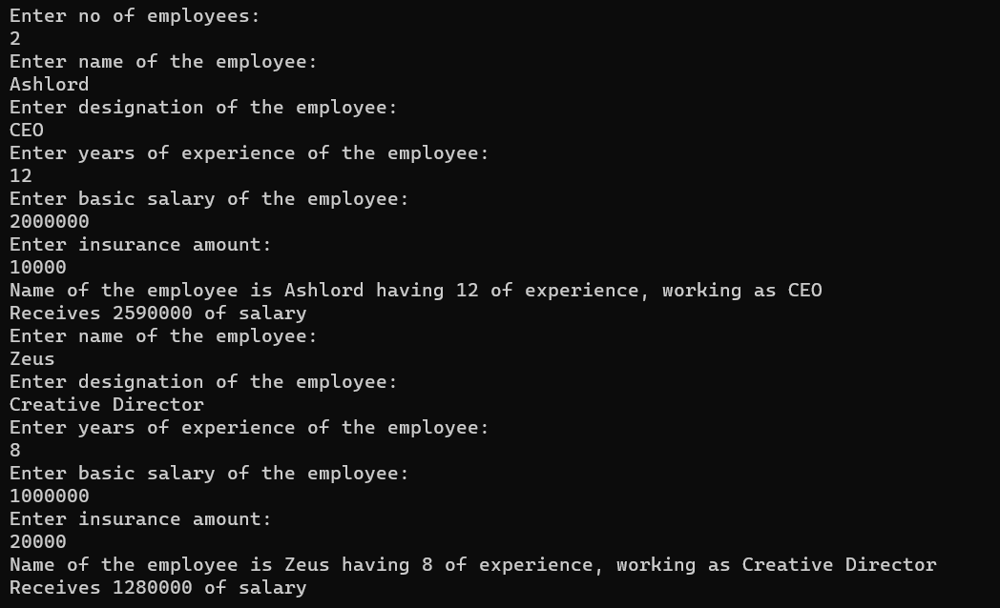

# Ex04-Constructor
## Aim:
 To write a C# program to calculate the salary of an employee by passing the name, designation, noofexperience, basic salary and insurance amount through constructor.
 
 ## Algorithm:
 ### Step 1:
 Create a class and a constructor.
 ### Step 2:
 Get name, designation, experience, basic salary and insurance amount from the User.
 ### Step 3:
 Call salary method in constructor to calculate salary.

 ### Step 4:
 Call display method to display the output.

 ### Step 5:
 Stop the program.
 

 ## Program:
 ```c#
 using System;

class Employee
{
    string name;
    string designation;
    int noOfExperience;
    double basicSalary;
    double insuranceAmount;

    public Employee(string name, string designation, int noOfExperience, double basicSalary, double insuranceAmount)
    {
        this.name = name;
        this.designation = designation;
        this.noOfExperience = noOfExperience;
        this.basicSalary = basicSalary;
        this.insuranceAmount = insuranceAmount;
    }

    public void salary()
    {
        double hra = 0.2 * basicSalary;
        double ta = 0.1 * basicSalary;
        double grossSalary = basicSalary + hra + ta - insuranceAmount;
        Console.WriteLine("Gross salary of {0}: {1}", name, grossSalary);
    }

    public void display()
    {
        Console.WriteLine("Name: {0}", name);
        Console.WriteLine("Designation: {0}", designation);
        Console.WriteLine("No. of years of experience: {0}", noOfExperience);
        Console.WriteLine("Basic salary: {0}", basicSalary);
        Console.WriteLine("Insurance amount: {0}", insuranceAmount);
        salary();
    }
}

class Program
{
    static void Main(string[] args)
    {
        Employee emp = new Employee("Zeus", "Director", 25, 7000000, 300000);
        emp.display();
    }
}
```
 ## Output:
 

 ## Result:
 Thus the C# program to calculate the salary of an employee by passing the name, designation, noofexperience, basic salary and insurance amount through constructor is executed successfully.
